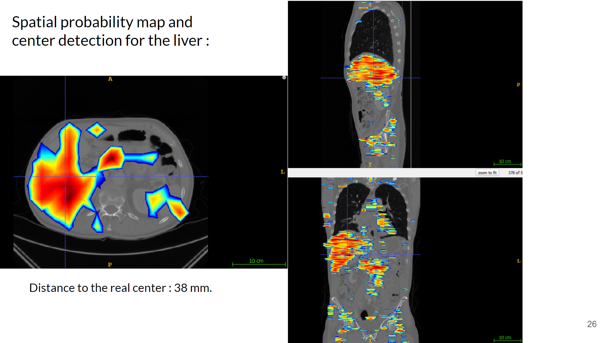
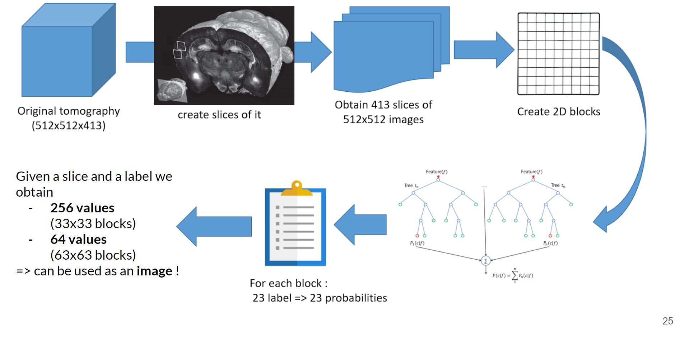
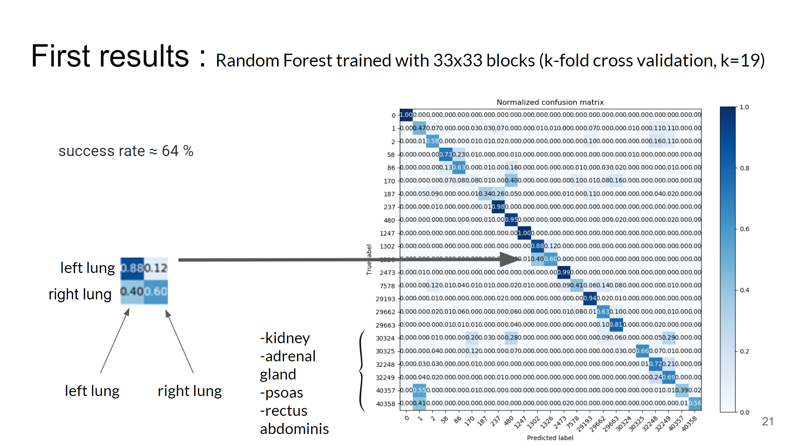

# Machine Learning applied for Organ Detection and Localization

## Table of Contents

- [Background](#background)
- [Dataset](#dataset)
    * Data extraction from human tomographies
    * Preprocessing and Dataset creation
- [RandomForest](#randomforest)
- [CNN](#cnn)
- [Conclusion](#conclusion)
- [Sources](#sources)
- [License](#license)

## Background

This project aims to :
* detect 23 human organs from a given tomography
* create segmentation overlays for each organs
* :children_crossing: allows me to discover data-processing, ML capabilities and data-science in general

I started this project during the Initiation to Ressearch  Project at [INSA Lyon](https://www.insa-lyon.fr/) and I still try to improve it even after being graded :construction_worker::chart_with_upwards_trend:.

## Dataset

I received **20 labeled and complete** 3D CT-scan (tomographies) provided by the Osaka University Hospital (Japan) and the [Visceral project](http://www.visceral.eu/).

Labels consist of segmentations layers created by medical experts which can be used as overlays in most of Medical Images Viewer (i.e. [ITK-SNAP](http://www.itksnap.org/pmwiki/pmwiki.php))

### Data Extraction

As we want to be able to recognize a **specific organ** in most of x-ray images, we will work with small 2D blocks : the goal is to be able to recognize an organ with the **smallest block size**. 

> Why the smallest block size as it reduces the amount of information per example ?

Sadly it **reduces** the amount of information given per example and, for some labels, making it almost impossible to differentiate a label from another.... BUT it allows us to
 - recognize better the smallest organs
 - get more predicted values per image and thus
 - get a well defined probability map for each organ : **useful** to create an overlay !

The process of data extraction is described in the following picture

As you can see I chose to work with 2 differents sizes (33x33 and 63x63) to measure the impact of the amount of spatial informations given to the RF/CNN.

### Training, Validation & Test Sets

## RandomForest

I started working with 33x33 blocks and I ended up with this first Confusion Matrix :

- total confusion between left/right side for relatively big organs (such as lungs) due to small block size
- quite good result for a first try (I assume)

**Walkthrough**

## Install

## Sources

## License
 (This work is licensed under a <a rel="license" href="http://creativecommons.org/licenses/by-nc-sa/4.0/">Creative Commons Attribution-NonCommercial-ShareAlike 4.0 International License)</a>.
#### [Antoine BALLIET](https://fr.linkedin.com/in/antoineballiet)

