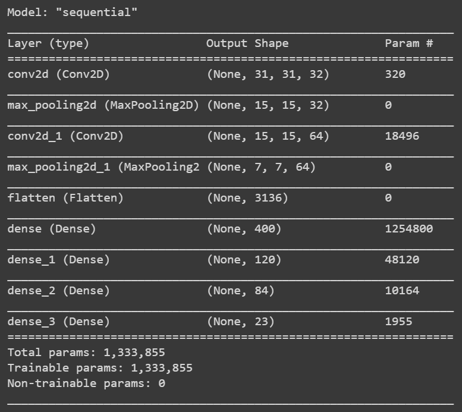

# Machine Learning applied to Organ Detection and Localization


## Table of Contents

- [Background](#background)
- [Dataset](#dataset)
    * Data extraction from human tomographies
    * Preprocessing and Dataset creation
- [RandomForest](#randomforest)
- [CNN](#cnn)
- [Conclusion](#conclusion)
- [License](#license)

## Background

This project aims to :
* detect 23 human organs from a given tomography
* create segmentation overlays for each organs
* introduce me to data-processing, ML and data-science in general :children_crossing: 

I started this project during the Initiation to Ressearch  Project at [INSA Lyon](https://www.insa-lyon.fr/) and still try to improve it even after being graded :construction_worker::chart_with_upwards_trend:.

## Dataset

I received **20 labeled and complete** 3D CT-scan (tomographies) provided by the Osaka University Hospital (Japan) and the [Visceral project](http://www.visceral.eu/).

Labels consist of segmentations layers created by medical experts which can be used as overlays in most of Medical Images Viewer (i.e. [ITK-SNAP](http://www.itksnap.org/pmwiki/pmwiki.php))


### Data Extraction

As we want to be able to recognize a **specific organ** in most of x-ray images, we will work with small 2D blocks : the goal is to be able to recognize an organ with the **smallest block size**. 

> Why the smallest block size as it reduces the amount of information per example ?

Sadly it **reduces** the amount of information given per example and, for some labels, making it almost impossible to differentiate a label from another.... BUT it allows us to
 - recognize better the smallest organs
 - get more predicted values per image and thus
 - get a well defined probability map for each organ : **useful** to create an overlay !

The process of data extraction is described in the following picture


As you can see I chose to work with 2 differents sizes (33x33 and 63x63) to measure the impact of the amount of spatial informations given to the RF/CNN.

### Training, Validation & Test Sets


## RandomForest

I started working with 33x33 blocks and I ended up with this first Confusion Matrix :


- total confusion between left/right side for relatively big organs (such as lungs) due to small block size
- very poor detection for smallest organes (i.e psoas, rectus, abdominis...)
- quite good result for a first try (I assume)

In order to better understand classification errors, I computed some **spatial probability maps** : given a slice (shape : 512,512) and a class (1 out of the 23), we predict the probability of each block of the slice.

In the case of 33x33 shaped blocks it gives 256 values which can be interpolated to recreate an image of the same shape as the orginal size. 

We can then plot probability maps as overlays :


## CNN

After digging a bit arround RF approach I discovered Neural Networks and more specifically CNN. At the meantime I discovered Google Colab which offers **FREE GPU** and a very intuitive Jupyter Notebook interface, TensorFlow & Keras ready to go !

### Model 1

I first trained a quite simple architecture



Then I decided to add an extra Conv2D layer, regularization and dropout to improve it

```python
model = Sequential([
    Conv2D(32, (3,3), padding="valid", activation='relu', input_shape=(33, 33, 1), kernel_regularizer=l2(0.001), strides=(2, 2)),
    Conv2D(64, (3,3) , padding="same", activation="relu", kernel_regularizer=l2(0.001), strides=(2, 2)),
    Conv2D(128, (3,3) , padding="same", activation="relu", kernel_regularizer=l2(0.001), strides=(2, 2)),
    Flatten(),
    Dense(800),
    Dropout(0.25),
    Dense(84),
    Dense(23, activation='softmax'),
```

Later on I switched to 63,63 shaped blocks to give more context to the CNN.


## Install

## Sources


## License
<a rel="license" href="http://creativecommons.org/licenses/by-nc-sa/4.0/"></a><br />(This work is licensed under a <a rel="license" href="http://creativecommons.org/licenses/by-nc-sa/4.0/">Creative Commons Attribution-NonCommercial-ShareAlike 4.0 International License)</a>.
#### [Antoine BALLIET](https://fr.linkedin.com/in/antoineballiet)

